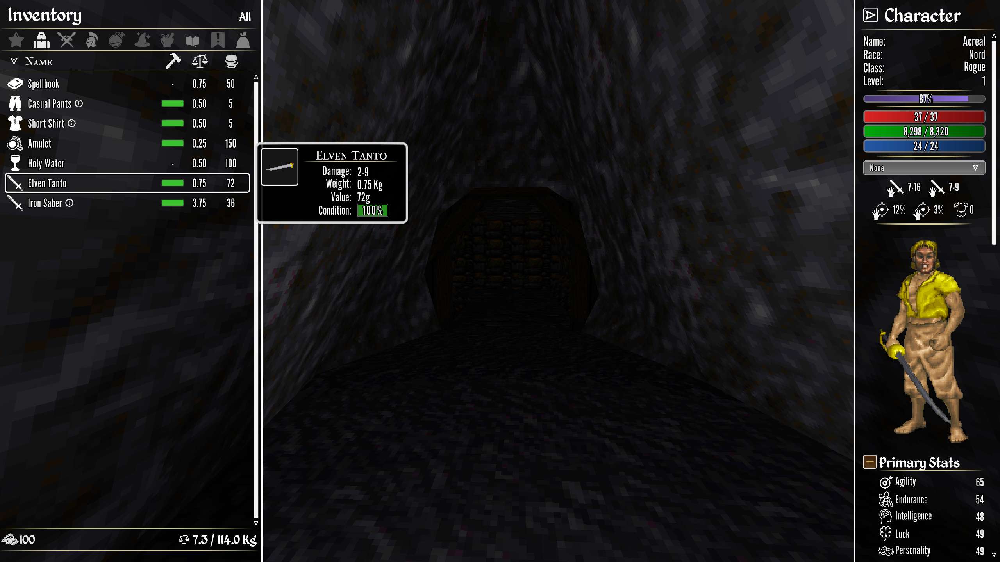
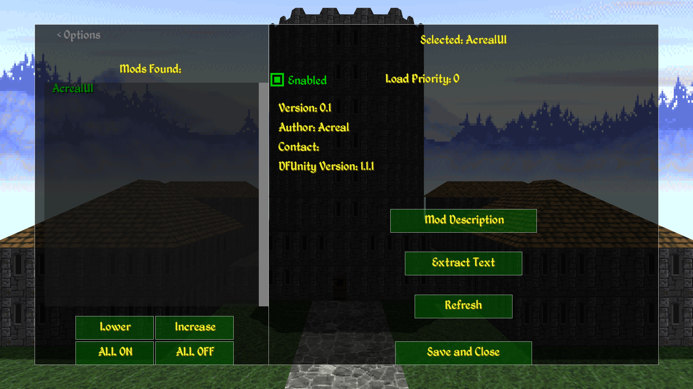
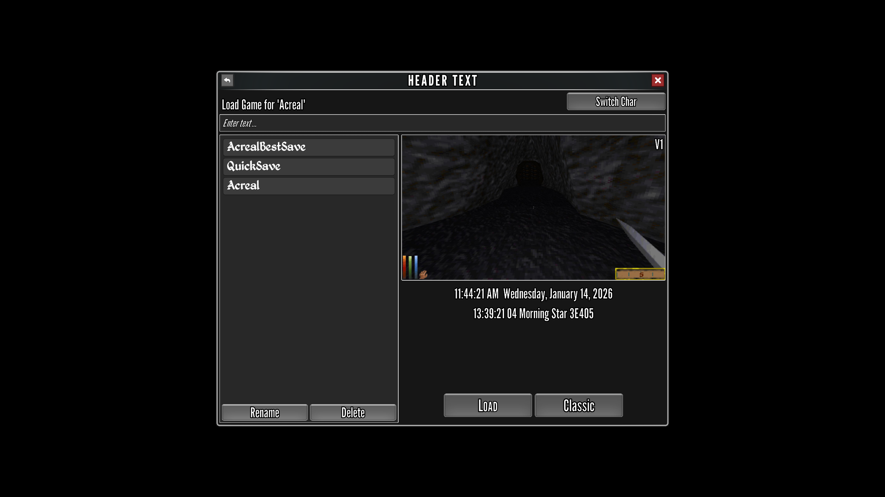

# Summary

This mod is designed to provide a more modern UI to Daggerfall Unity, with the quality of life features
we're used to from more recent RPG titles. It is completely safe to toggle this mod on or off at any
point during a playthrough; it is simply a UI change and will not affect your save in any way.

# Installation
Copy and paste 'acrealui.dfmod' into your 'Mods' folder inside of the Daggerfall Unity install location.
This should be located at: 'DaggerfallUnity_Data\StreamingAssets\Mods'

That's it! Just make sure you have the mod enabled in your mod list, and that it is loaded after
any other mods that might modify menus. 

(NOTE: other UI mods may render over the top of these menus - especially those that change or add 
elements to the HUD - so you may need to disable those mods.)

# Development Progress
So far the pause menu(s), save/load menu, and inventory menus are in and functioning. Some of the art
is not in place, and there may be some bugs that pop up, but otherwise it should be fully playable.
